# MyBallsSurvival_V1
Hi, this is my simple game, named "My Balls Survival"!
The action take place on a random map.
You have main base and 5 balls, which can dig, grow earth, mine wood, minerals and build sensors!
The main quest is to find GEM and bring it to base.
In random time the pit appears and generates enemy dark balls, they disturb you.  
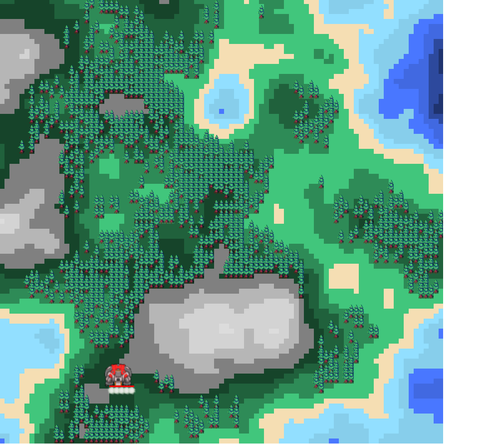  
You have three management styles:
1) Action key and action order(SPACE), to order choose action for one unemployed ball. This ball on one's own will find nearest target to do action.  
  Press the desired bottom an then press "space". You can press spase many time or hold space to order the same command for next unemployed ball.   
  **This code look like e.g: W+**

2) Action key and action order(MOUSE), to order choose action for one unemployed ball in clicked position on map.  
  Press the desired bottom and click mouse on a map. You can click many time to order the same command in specific point on a map for next unemployed ball.  
  **This code look like e.g: A-**

3) Action key and MOUSE DRAG. You can draw on map and mark cells for action 1.  
  Press the desired bottom and click or move around map witch the mouse button pressed.  
  **This code look like e.g: A--**

There is a few commands to manage your balls :

***Q-*** : Move furthest unit to current point;  
***A-*** : Move nearest unit to current point;  
***B-*** : Move nearest unit to place bomp in current point;  
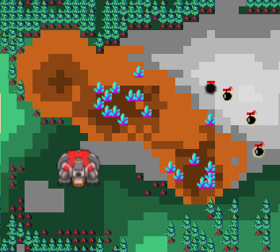  

***E-*** : Move nearest unit to build sensor in current point;    
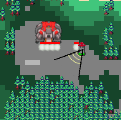  

***F--*** : Mark cells for order to dig (***D+***);  
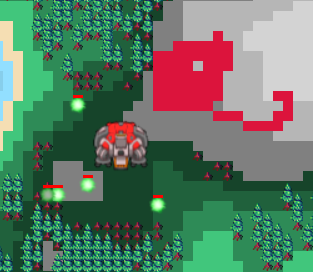  

***H--*** : Mark cells for order to grow earth(***G+***);  
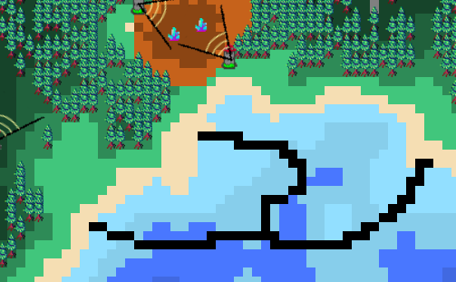  

***С+*** : Order to mine minerals;  
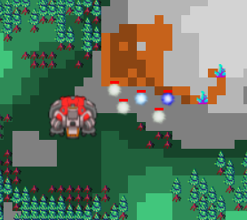  

***X+*** : Order to take GEM;  
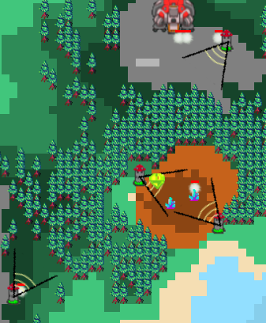  

***W+*** : Order to mine trees;  
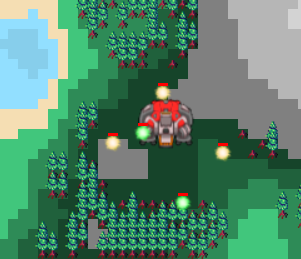  

***S+*** : Order to stop сurrent order(became uneployed);  

***D+*** : Order to dig makred cells(***F--***);   
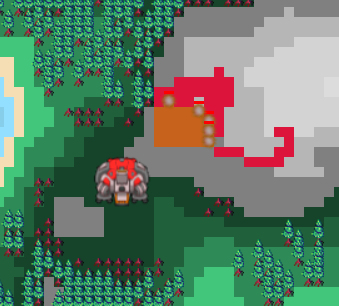  

***G+*** : Order to grow earth makred cells(***H--***);   
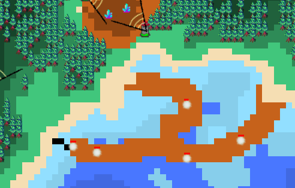  

***R+*** : Crear all marked cells;  

# Basic Mechanics:
Generated map have three parameters.
1) Map size - standard size 712x712, but you can change it in any size which multiple Cell size.  
2) Cell size - standard size 8, but you can change in any size multiple 2.  
3) Diamond-square algorithm - you can change the area of water/earth/mountains.  
4) Game speed - every interval of time all map units may change position, HP-points, status. You can make gameplay slower of faster.

Generated map is an two-dimensional array of cells.
Every cell has a few parameters:
1) Height. Height can value between 0...12. 0...5 - water, 6 - sand, 7...9 - green, 10...12 - mountains. Every cell has color depends height.  
2) Contain tree. Tree can grow only on green cell(7...9).
3) Contain crystal. Crystal exists only on cells with height more then 6. The more height, the more chance from cell to contain crystal. Crystal has random deep between height and zero. Cell contain crystal can't contain gem.  
4) Contain gem. Only one gem generates on a map. Gem cant generate on water and has depp between height cell and zero. Cell contain gem can't contain crystal.  

Balls:  
Balls can't exist in water, they go around the water. If ball touch water he die.  

Filling water:  
Every cell with height lower then 6 and has water around itself will become a water cell.  

Digging:  
Every ball with complete(***D+***) has digged groud in 3 points. This  height value of current cell become lover on 3(if > 0). Ball can find crystal or gem if they height in ground became higher then digged.  Exploted bomb(***B-***) digged in sphere wich radius 5 cells.  Enemy balls creates exploy sphere wich radius 3 cells when touch nearest ball. 

Enemy hole:  
In random time in random place appears hole, wich generates enemy units. They walking an seek your units to explode.  
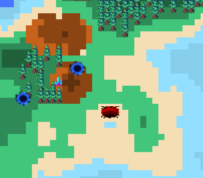  

Health:
All your units has his own HP. If unit come far away from main base, he will loose 1 HP point every iteration. If unit is near main base, he regen max his HP. If HP = 0 unit die.   
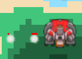  

Enjoy!

