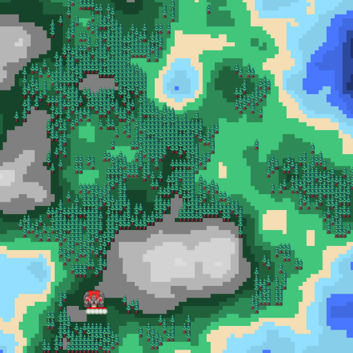

# MyBallsSurvival_V1
Hi, this is my simple game, named "My Balls Survival"!
The action take place on a random map.
You have main base and 5 balls, which can dig, grow earth, mine wood, minerals and build sensors!
The main quest is to find GEM and bring it to base.
In random time the pit appears and generates enemy dark balls, they disturb you.  
  
You have three management styles:
1) Action key and action order(SPACE), to order choose action for one unemployed ball. This ball on one's own will find nearest target to do action.  
  Press the desired bottom an then press "space". You can press spase many time or hold space to order the same command for next unemployed ball.   
  **This code look like e.g: W+**

2) Action key and action order(MOUSE), to order choose action for one unemployed ball in clicked position on map.  
  Press the desired bottom and click mouse on a map. You can click many time to order the same command in specific point on a map for next unemployed ball.  
  **This code look like e.g: A-**

3) Action key and MOUSE DRAG. You can draw on map and mark cells for action 1.  
  Press the desired bottom and click or move around map witch the mouse button pressed.  
  **This code look like e.g: A--**

There is a few commands to manage your balls :

***Q-*** : Move furthest unit to current point;  
***A-*** : Move nearest unit to current point;  
***B-*** : Move nearest unit to place bomp in current point;  
  

***E-*** : Move nearest unit to build sensor in current point;    
  

***F--*** : Mark cells for order to dig (***D+***);  
  

***H--*** : Mark cells for order to grow earth(***G+***);  
  

***С+*** : Order to mine minerals;  
  

***X+*** : Order to take GEM;  
  

***W+*** : Order to mine trees;  
  

***S+*** : Order to stop сurrent order(became uneployed);  

***D+*** : Order to dig makred cells(***F--***);   
***G+*** : Order to grow earth makred cells(***H--***);   
***R+*** : Crear all marked cells;  

Basic Mechanics:
Generated map have three parameters.
1) Map size - standard size 712x712, but you can change it in any size which multiple Cell size.  
2) Cell size - standard size 8, but you can change in any size multimle 2.  
3) Diamond-square algorithm - you can change the area of water/earth/mountains.  

Enjoy!

